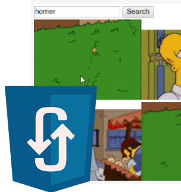

# AJAX two APIs ![badge]



Two little apps, first provides 5 gifs from Giphy, based on entered keyword and second displays first 30 Github users.
Both apps works with Giphy's and Github's API.

[badge]: https://img.shields.io/badge/status-stable-green.svg

### Project completed

All features implemented and working.


### Core
```js
var xhr = new XMLHttpRequest();

function mainFunction() {
  xhr.open("GET", "https://api", true);
  var source = JSON.parse(this.responseText);
  for (var i = 0; i < source.length; i++) {
    for (var i in source) {
      //display
```